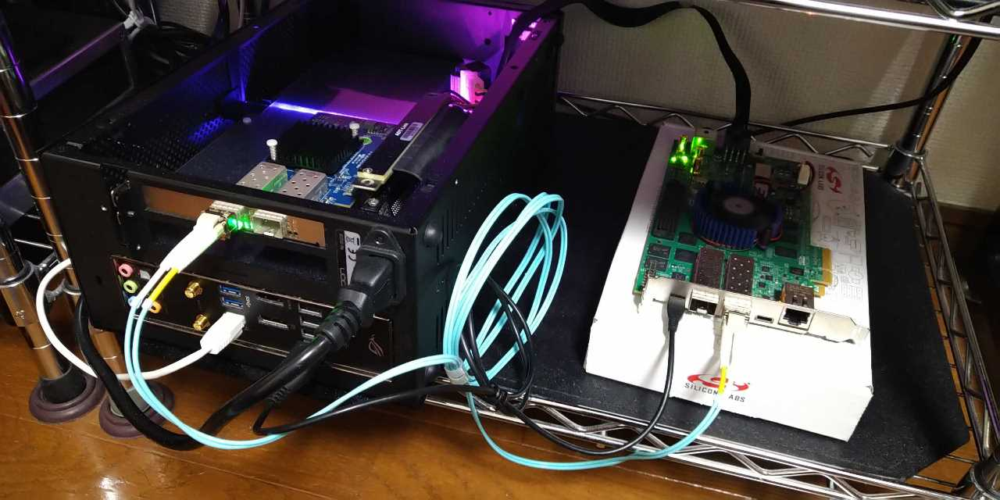

# c10gx\_icmp\_server

## Overview
- Dedicated ping (IPv4 ICMP) reply server design example for a ["Intel Cyclone 10 GX FPGA Development Kit"](https://www.intel.com/content/www/us/en/programmable/products/boards_and_kits/dev-kits/altera/cyclone-10-gx-development-kit.html).
- Pipelined ARP and ICMP responder written in i++ HLS code enables almost 10Gbps capacity and low latency under 1 microseconds.
- Please change MAC and IP address stored in `src/arp_proc/arp_proc.cpp` before testing on your environment, default value is just for documentation.
- This software is provided "as-is", with no warranty or guarantee.

## Licenses
- Since this software is based on ["Cyclone 10 GX PCIe Gen2 x4 DMA Design Example"](https://fpgacloud.intel.com/devstore/platform/17.1.2/Pro/cyclone-10-gx-pcie-gen2-x4-dma/), codes derived from design example and the other wizard-generated file from Intel tools follow ["License Terms and Conditions for Hardware Reference Designs an/or Design Examples"](https://www.intel.com/content/www/us/en/programmable/common/legal/leg-license_agreement.html) and other Terms of Use conditions.
- Newly written codes are licensed under MIT license, see header of indivisual files.

## Tested on
- hardware
  + 10gtek X520-10G-2S-X8 Ethernet CNA/NIC
  + 2 pieces of Generic 10GBase-SR SFP+
  + 2 meter LC-LC multi-mode optical fiber patch code
  + Intel Cyclone 10 GX FPGA Development Kit
- software
  + Ubuntu 18.04.5 LTS (officially not suppoted OS of Quartus tools)
  + Intel Quartus Prime Pro Edition for Linux, Version 20.1
  + Intel HLS Compiler Pro Edition for Linux
  + The Nios II SBT for Eclipse on Linux environment

## usage

- hardware setup
  + Prepare a host PC with 10G NIC installed.
  + Power the c10gx devkit and connect to a host with micro-USB cable. (note : USB type-C port is not available for configuration)
  + Connect the c10gx devkit to a host with some 10G SFPs and optical cables.
    * note : passive DAC (Direct Attached Copper) cables are not preferrable for test, they will require strict equalizer/pre-emphasis settings on FPGA transceiver not included on this project.

- software setup

  + Be sure the commands quartus, eclipse-nios2 and i++ successfully installed and introduced on PATH variables.
  + `$ git clone https://github.com/homelith/c10gx_icmp_server.git`
  + Change MAC and IP address stored in `src/arp_proc/arp_proc.cpp` according to your local testing environment.
  + `$ cd c10gx_icmp_server`
  + `$ make` and wait for CLI automated compilation
  + Confirm usb-blaster device is connected and recognized as only one usb-blaster on host PC.
  + `$ cd syn ; make program` to program 1st recognized usb-blaster device assumed as c10gx devkit.

- ping test
  + Set suitable IP address on 10G NIC of the host PC.
  + `$ ping {IP specified in src/arp_proc/arp_proc.cpp}` and see the outputs.

## note

- TARGET\_FREQ value of HLS compiling Makefile (e.g. src/icmp\_proc/Makefile) is currently set to 50MHz, much slower than its drive clock 156.25MHz.
  + TARGET\_FREQ=150MHz setting generates II=3 codes limits pipeline speed to 3.3Gbps while TARGET\_FREQ=50MHz generated codes are successfully prace & routed in 156.25MHz.
  + Target frequency estimator for cyclone 10 GX may not be well sophisticated yet ?
